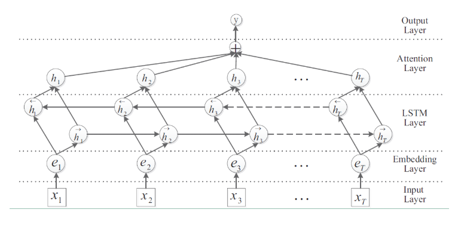

## Bi-LSTM+Attention (Attention-Based Bidirectional Long Short-Term Memory Networks for Relation Classification)

### 数据集：
#### SougouNews (http://www.sogou.com/labs/resource/cs.php) 中选出10个类别的新闻，每个类别5000个样本，组成总量为50000的数据集：
    it、women、business、sports、yule、learning、travel、auto、health、house

### 数据形式：
#### label \t content

### 文件解释
* main.py —— 主文件
* model.py —— 模型结构
* config.py —— 配置参数
* Data_Generate_SogouNews.py —— SougouNews新闻数据集处理脚本
* /data —— 数据存放文件夹
* /save_model —— 模型存储文件夹

### 模型结构

* Bi-LSTM+Attention就是在Bi-LSTM的模型上加入Attention层，在Bi-LSTM中我们会用最后一个时序的输出向量作为特征向量，然后进行Softmax分类。Attention是先计算每个时序的权重，然后将所有时序的向量进行加权和作为特征向量，然后进行Softmax分类。在实验中，加上Attention确实对结果有所提升。

### 参考资料
* Attention-Based Bidirectional Long Short-Term Memory Networks for Relation Classification Classification (https://www.aclweb.org/anthology/P16-2034.pdf)
* https://www.cnblogs.com/jiangxinyang/p/10208227.html

