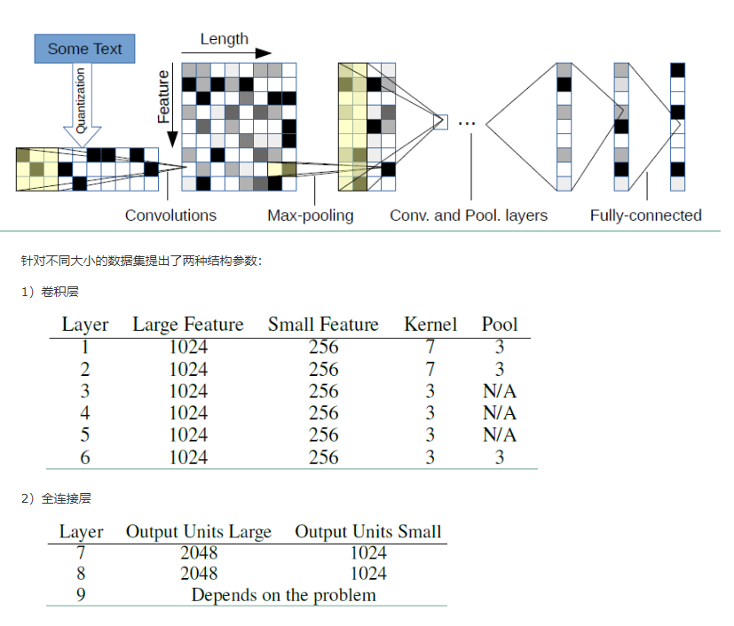

## Char-CNN (Character-level Convolutional Networks for Text Classification)

### 数据集：
#### SougouNews (http://www.sogou.com/labs/resource/cs.php) 中选出10个类别的新闻，每个类别5000个样本，组成总量为50000的数据集：
    it、women、business、sports、yule、learning、travel、auto、health、house

### 数据形式：
#### label \t content

### 文件解释
* main.py —— 主文件
* model.py —— 模型结构
* config.py —— 配置参数
* Data_Generate_SogouNews.py —— SougouNews新闻数据集处理脚本
* /data —— 数据存放文件夹
* /save_model —— 模型存储文件夹

### 模型结构

* 模型主要特点是堆叠了6个卷积层、3个池化层、3个全连接层组成卷积网络对文本进行处理。

### 参考资料
* Character-level Convolutional Networks for Text Classification (https://arxiv.org/abs/1509.01626)
* https://www.cnblogs.com/jiangxinyang/p/10207686.html

