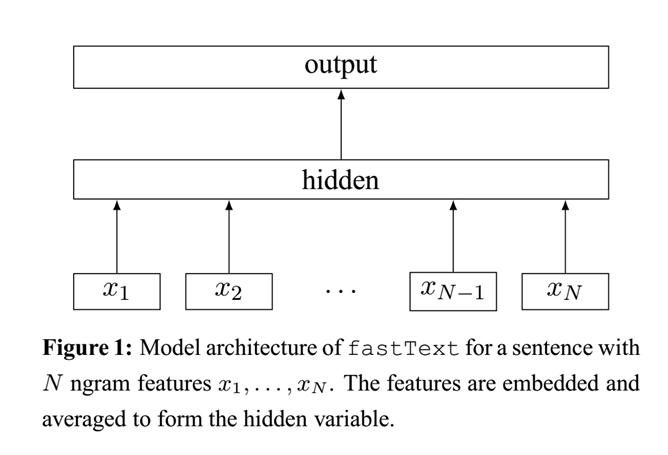

## FastText (Bag of Tricks for Efficient Text Classification)

Practically if your total number of categories is in the range of hundreds to thousands (less than 50K), you don't need to consider using hierarchical softmax, which is designed to run training faster for classifying into millions of categories (for example, the number of words in a vocabulary).——(https://stackoverflow.com/questions/47313656/tensorflow-hierarchical-softmax-implementation)

此处实现的是1-Gram特征(以word为单元)，由于数据类别为10类且均衡，因此未实现Hierarchical Softmax机制。

### 数据集：
#### SougouNews (http://www.sogou.com/labs/resource/cs.php) 中选出10个类别的新闻，每个类别5000个样本，组成总量为50000的数据集：
    it、women、business、sports、yule、learning、travel、auto、health、house

### 数据形式：
#### label \t content

### 文件解释
* main.py —— 主文件
* model.py —— 模型结构
* config.py —— 配置参数
* Data_Generate_SogouNews.py —— SougouNews新闻数据集处理脚本
* /data —— 数据存放文件夹
* /save_model —— 模型存储文件夹

### 模型结构

* FastText的网络结构与word2vec中的CBOW很相似，如图1所示。模型主要包含一个投影层和一个输出层，与CBOW的结构一样，其中，与CBOW主要有两点不同：第一个是CBOW的输入是每个单词的上下文单词，而FastText的输入的一个文本中的特征，可以是Ngram语言模型的特征；第二个是CBOW的输出的目标词汇，而FastText的输出则是文本的类别。

### 参考资料
* Bag of Tricks for Efficient Text Classification (https://arxiv.org/abs/1607.01759)
* https://blog.csdn.net/linchuhai/article/details/86648074

