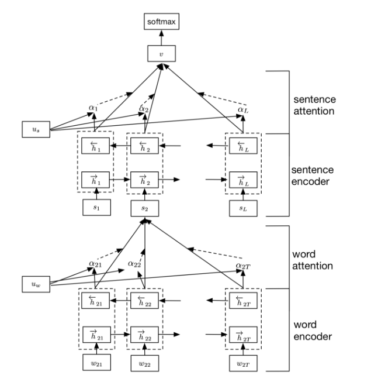

## HAN (Multilingual Hierarchical Attention Networks for Document Classification)

### 数据集：
#### SougouNews (http://www.sogou.com/labs/resource/cs.php) 中选出10个类别的新闻，每个类别5000个样本，组成总量为50000的数据集：
    it、women、business、sports、yule、learning、travel、auto、health、house

### 数据形式：
#### label \t content

### 文件解释
* main.py —— 主文件
* model.py —— 模型结构
* config.py —— 配置参数
* Data_Generate_SogouNews.py —— SougouNews新闻数据集处理脚本
* /data —— 数据存放文件夹
* /save_model —— 模型存储文件夹

### 模型结构

* HAN的全称为Hierarchical Attention Network(层次注意网络)，从字面意思可以理解其是一个分层注意力架构模型，该模型主要用于文档分类(长文本)。HAN主要有两个层次的模型架构：词汇级别和句子级别，每个层次的模型都包括一个编码器和注意力模型两个部分，整个模型的细节可参考以下资料或原论文。

### 参考资料
* Multilingual Hierarchical Attention Networks for Document Classification (https://arxiv.org/abs/1707.00896)
* https://blog.csdn.net/linchuhai/article/details/87281435

