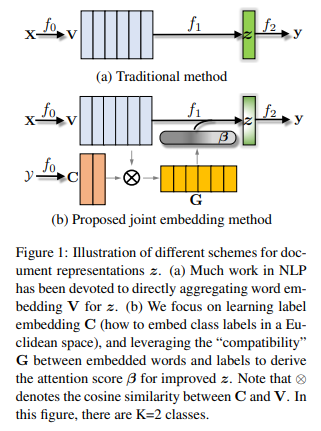

## LEAM (Joint Embedding of Words and Labels for Text Classification)

### 数据集：
#### SougouNews (http://www.sogou.com/labs/resource/cs.php) 中选出10个类别的新闻，每个类别5000个样本，组成总量为50000的数据集：
    it、women、business、sports、yule、learning、travel、auto、health、house

### 数据形式：
#### label \t content

### 文件解释
* main.py —— 主文件
* model.py —— 模型结构
* config.py —— 配置参数
* Data_Generate_SogouNews.py —— SougouNews新闻数据集处理脚本
* /data —— 数据存放文件夹
* /save_model —— 模型存储文件夹

# 模型结构

*  LEAM论文标题就可以发现，该方法主要是构建类别标签(label)与词向量(word-embedding)的联合嵌入，使用注意力机制(Attention)作为label与word-embedding沟通的桥梁。通常其他算法如TextCNN，FastText，TextRCNN，HAN等，只把类别标签(label)作用于网络的最后一层，即计算loss等的时候使用，LEAM可以看成是引入类别标签(label)信息。

### 参考资料
* Joint Embedding of Words and Labels for Text Classification (https://arxiv.org/abs/1805.04174)
* https://blog.csdn.net/rensihui/article/details/105263327

