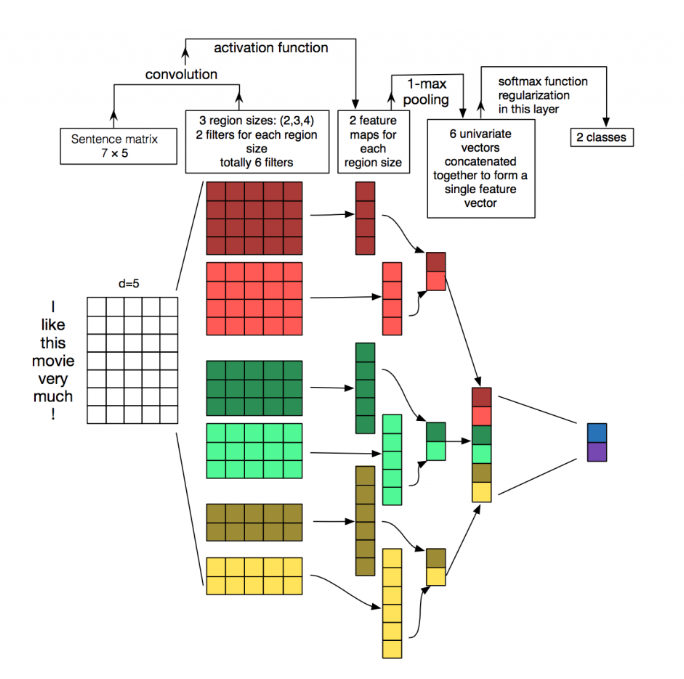

## TextCNN (Convolutional Neural Networks for Sentence Classification)

### 数据集：
#### SougouNews (http://www.sogou.com/labs/resource/cs.php) 中选出10个类别的新闻，每个类别5000个样本，组成总量为50000的数据集：
    it、women、business、sports、yule、learning、travel、auto、health、house

### 数据形式：
#### label \t content

### 文件解释
* main.py —— 主文件
* model.py —— 模型结构
* config.py —— 配置参数
* Data_Generate_SogouNews.py —— SougouNews新闻数据集处理脚本
* /data —— 数据存放文件夹
* /save_model —— 模型存储文件夹

### 模型结构

* TextCNN中采用的是一维卷积，每个卷积核的大小为h×k(h为卷积核的窗口大小，k为词向量的维度)，文中采用了多种不同尺寸的卷积核，用以提取不同文本长度的特征(上图种可以看见，卷积核有h=2, 3, 4三种)，然后，作者对于卷积核的输出进行MaxPooling，目的是提取最重要的特征。将所有卷积核的输出通过MaxPooling之后拼接形成一个新向量，再将该向量输出到全连接层分类器(Dropout + Linear + Softmax)实现文本分类。

### 参考资料
* Convolutional Neural Networks for Sentence Classification (https://arxiv.org/abs/1408.5882)
* https://www.cnblogs.com/bymo/p/9675654.html

