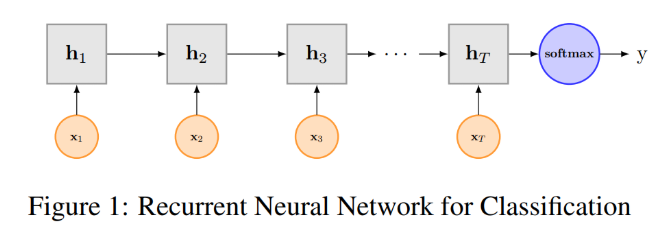

## TextRNN (Recurrent Neural Network for Text Classification with Multi-Task Learning)

### 数据集：
#### SougouNews (http://www.sogou.com/labs/resource/cs.php) 中选出10个类别的新闻，每个类别5000个样本，组成总量为50000的数据集：
    it、women、business、sports、yule、learning、travel、auto、health、house

### 数据形式：
#### label \t content

### 文件解释
* main.py —— 主文件
* model.py —— 模型结构
* config.py —— 配置参数
* Data_Generate_SogouNews.py —— SougouNews新闻数据集处理脚本
* /data —— 数据存放文件夹
* /save_model —— 模型存储文件夹

### 模型结构

* 文本分类任务中，CNN可以用来提取句子中类似N-Gram的关键信息，适合短句子文本。TextRNN擅长捕获更长的序列信息。具体到文本分类任务中，从某种意义上可以理解为可以捕获变长、单向的N-Gram信息（Bi-LSTM可以是双向）。普通RNN在处理较长文本时会出现梯度消失问题，因此文本中RNN选用LSTM/GRU进行实验。

### 参考资料
* Recurrent Neural Network for Text Classification with Multi-Task Learning (https://arxiv.org/abs/1605.05101)
* https://zhuanlan.zhihu.com/p/96050637

